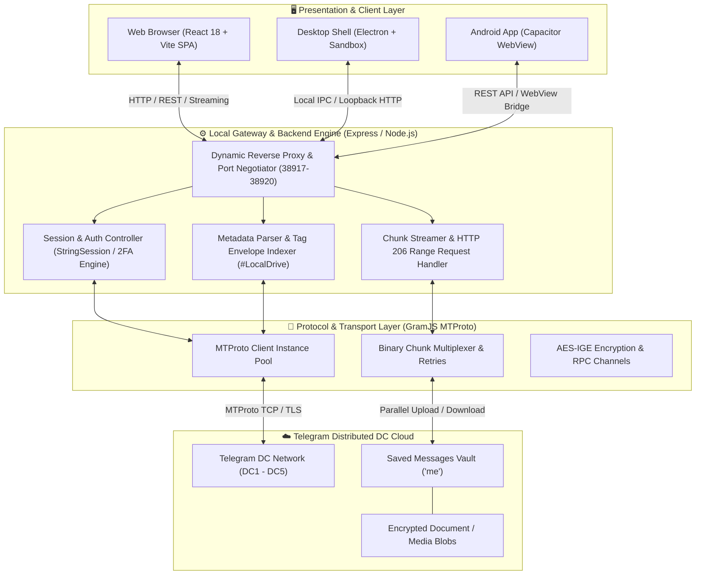
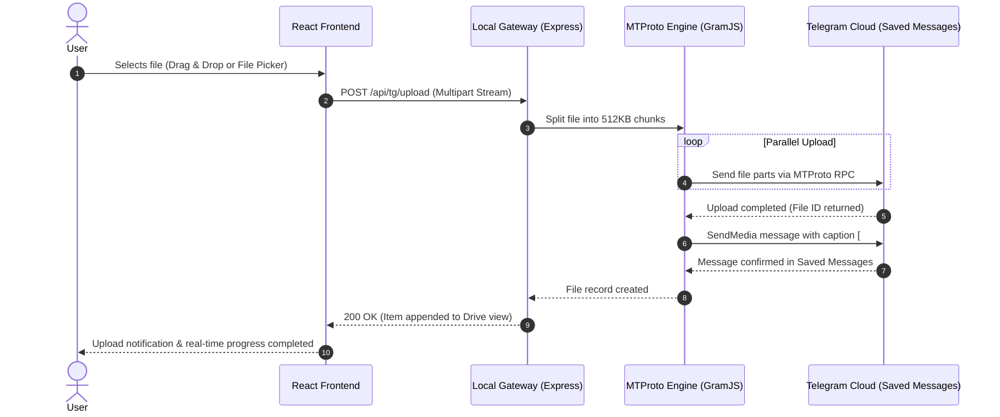
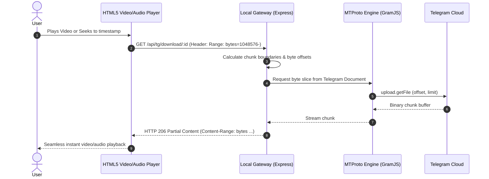

# 🚀 Local Drive (Official)

<div align="center">

[](https://opensource.org/licenses/MIT)
[](https://www.typescriptlang.org/)
[](https://reactjs.org/)
[](https://vitejs.dev/)
[](https://tailwindcss.com/)
[](https://www.electronjs.org/)
[](https://nodejs.org/)
[](https://core.telegram.org/mtproto)
[](https://www.supportkori.com/arafathrahman)

<p align="center">
  <strong>A high-performance, cross-platform personal cloud drive that leverages Telegram's distributed data centers for unlimited, free cloud storage.</strong>
</p>

<p align="center">
  <a href="#-key-features">Key Features</a> •
  <a href="#-system-architecture">System Architecture</a> •
  <a href="#-data-flow-pipelines">Data Flow</a> •
  <a href="#-getting-started">Getting Started</a> •
  <a href="#-desktop--mobile-builds">Platform Builds</a> •
  <a href="#-support--buy-me-a-coffee">Support</a>
</p>

</div>

---

## 📖 Overview

**Local Drive** is a modern cloud storage ecosystem engineered as an alternative to proprietary, subscription-gated cloud services like Google Drive and Dropbox. By utilizing Telegram's MTProto API as an underlying decentralized storage backend, Local Drive offers **unlimited cloud storage with zero monthly recurring costs**.

Unlike simple bot-based scripts, Local Drive implements a complete full-stack architecture featuring an embedded high-speed streaming server, client-side session management, real-time transfer tracking, and native desktop (Windows Electron) and mobile (Android) apps.

---

## ✨ Key Features

- **⚡ Unlimited Cloud Storage:** Store unlimited files up to **2 GB per file** (Telegram standard media limit) directly in your private Telegram cloud.
- **🛡️ Zero-Knowledge & Privacy First:** No third-party databases holding your files. All files reside directly in your private Telegram *Saved Messages* using encrypted MTProto client sessions.
- **🎬 Instant Media Streaming (HTTP 206 Range Requests):** Stream 4K/1080p videos and audio files on-the-fly without waiting for the full file to download locally.
- **📂 Hierarchical File System:** Create nested folders, customize folder colors, rename, move, star, and soft-delete files with a dedicated Recycle Bin / Trash quarantine.
- **🚀 Real-Time Speed & Transfer Engine:** Live upload and download speed meters with rolling-window smoothing (Mbps), stage trackers, and multi-threaded chunk pipelines.
- **🖥️ True Cross-Platform Experience:**
  - **Web Application:** Responsive, fluid UI built with React 18, Vite, and Tailwind CSS.
  - **Desktop Application (Windows):** Built with Electron, offering background daemon execution, native window chrome, and system tray integration.
  - **Android Mobile App:** Hybrid native integration powered by Capacitor for on-the-go file management.
- **🔐 Secure Authentication:** Seamless login via phone number, verification code, and full support for Telegram Two-Step Verification (2FA Cloud Password).

---

## 🏗️ System Architecture

Local Drive is architected into four decoupled, highly specialized tiers:



---

### Layer-by-Layer Architecture Breakdown

#### 1. Presentation & Client Layer
- **React 18 + TypeScript:** Delivers a component-driven, type-safe interface for managing files, cards, context menus, and inspection modals.
- **Drive Context (`DriveContext.tsx`):** Maintains global client state including active directories, starred items, search filters, and live transfer queues.
- **Transfer Monitor:** Features a rolling speed meter that samples byte throughput every millisecond to render smooth, jitter-free transfer graphs in Mbps.
- **Desktop Electron Container (`electron/main.cjs`):** Launches an isolated, sandboxed window that auto-negotiates an open loopback port (38917–38920) to host the embedded server locally.

#### 2. Local Gateway & API Server (`server.ts`)
- **Express Backend:** Acts as an abstraction layer between standard HTTP REST queries and MTProto remote procedure calls (RPC).
- **HTTP 206 Partial Content Streaming Engine:** Intercepts browser `Range: bytes=start-end` request headers. It translates byte ranges into MTProto chunk requests, downloading only the exact slices needed for video playback or audio seeking.
- **Metadata Envelope Protocol:** Because Telegram messages don't have native folder hierarchies, Local Drive stores metadata (filename, folder ID, parent folder, timestamps, and tags) directly within the message payload and caption tagged with `#CloudGram` / `#LocalDrive`.

#### 3. MTProto Transport Core (GramJS)
- **High-Speed Binary Transfer:** Operates on raw Telegram MTProto protocol via GramJS, avoiding bot API rate limits and file size restrictions (up to 2GB vs bot 50MB limit).
- **Session String Architecture:** Generates an encrypted `StringSession` during the Telegram login handshake. This session token is kept locally on the client/cookie and is never uploaded to any remote database.

#### 4. Telegram Distributed Storage Vault
- All files are securely committed to Telegram's global data centers in your private `Saved Messages` conversation.
- Files benefit from Telegram's enterprise-grade replication, uptime, and unlimited archival capacity.

---

## 🔄 Data Flow Pipelines

### ⬆️ File Upload Pipeline



---

### ⬇️ Streaming & Download Pipeline



---

## 💻 Tech Stack Matrix

| Area | Technology | Purpose |
| :--- | :--- | :--- |
| **Frontend Framework** | React 18 + TypeScript | Component architecture, state synchronization, and reactive UI |
| **Build Tooling** | Vite | Lightning-fast HMR and optimized production bundling |
| **Styling & Icons** | Tailwind CSS + Lucide Icons | Responsive modern design, dark/light themes, and custom icons |
| **Desktop Runtime** | Electron | Cross-platform desktop shell with system isolation and auto-porting |
| **Mobile Runtime** | Capacitor | Native Android wrapper bridging Web UI to mobile hardware |
| **Backend Framework** | Node.js + Express | REST API, multipart file parsing, and streaming proxy |
| **Protocol Engine** | GramJS (`telegram`) | Direct MTProto client implementation for high-speed Telegram RPC |
| **File Parsing** | Multer | Memory-efficient multipart stream piping |
| **Packaging** | electron-builder | Production Windows `.exe` installers (NSIS) and portable executables |

---

## 🚀 Getting Started

### Prerequisites

- **[Node.js](https://nodejs.org/)** (v18.x or v20.x recommended)
- **npm** or **yarn**
- **Telegram API Credentials:** Obtain your free `API_ID` and `API_HASH` from [my.telegram.org](https://my.telegram.org) under *API Development Tools*.

---

### 1. Clone the Repository

```bash
git clone https://github.com/smartworldarafath/Local-Drive-Official.git
cd Local-Drive-Official
```

### 2. Install Dependencies

```bash
npm install
```

### 3. Configure Environment Variables

Copy the example environment file:

```bash
cp .env.example .env
```

Edit `.env` with your API credentials (or use default development values):

```ini
# Telegram API Credentials (from https://my.telegram.org)
TELEGRAM_API_ID=your_api_id_here
TELEGRAM_API_HASH=your_api_hash_here

# Random secret string for signing session cookies
SESSION_SECRET=your_custom_secret_key_here

# Environment
NODE_ENV=development
```

### 4. Run in Development Mode

To run the full stack (Vite Dev Server + Express MTProto Backend):

```bash
npm run dev
```

Open [http://localhost:3000](http://localhost:3000) in your browser.

---

## 🖥️ Desktop & Mobile Builds

### Run Electron Desktop Locally

```bash
npm run electron
```

### Build Windows Installer (.exe)

Compile a production-ready NSIS Windows installer:

```bash
npm run dist:win-installer
```
*Output will be generated in the `release/` directory.*

### Build Android APK

The project is pre-configured with Capacitor for Android:

```bash
cd android
./gradlew assembleRelease
```

---

## ⚙️ Available Scripts

| Script | Description |
| :--- | :--- |
| `npm run dev` | Starts backend server and Vite frontend in development mode |
| `npm run build` | Builds the Vite production bundle to `dist/` |
| `npm run build:server` | Bundles `server.ts` into `dist-electron/server.mjs` |
| `npm run electron` | Builds frontend/backend and launches the Electron desktop app |
| `npm run dist:win` | Packages Windows standalone portable binaries |
| `npm run dist:win-installer` | Generates the official Windows setup installer (`.exe`) |
| `npm run lint` | Runs TypeScript type checking without emitting files |

---

## ☕ Support / Buy Me a Coffee & Become a Sponsor

If you find **Local Drive** helpful and want to support ongoing development, maintenance, and new features, consider contributing through any of the options below! Your support means the world and helps keep this project open-source.

<div align="center">

<table>
  <tr>
    <td align="center" width="25%" valign="top">
      <h4>☕ SupportKori</h4>
      <a href="https://www.supportkori.com/arafathrahman" target="_blank">
        
      </a><br/><br/>
      <a href="https://www.supportkori.com/arafathrahman" target="_blank">
        
      </a><br/>
      <sub>Cards / bKash / Nagad / Global</sub>
    </td>
    <td align="center" width="25%" valign="top">
      <h4>⚡ nsave</h4>
      <br/><br/>
      <br/>
      <sub>Ntag: <code>@arafath_rahman9</code></sub>
    </td>
    <td align="center" width="25%" valign="top">
      <h4>🔴 RedotPay</h4>
      <br/><br/>
      <br/>
      <sub>ID: <code>1965421414</code></sub>
    </td>
    <td align="center" width="25%" valign="top">
      <h4>🅿️ Payoneer</h4>
      <br/><br/>
      <a href="mailto:arafathrahman710@gmail.com?subject=Support%20via%20Payoneer">
        
      </a><br/>
      <sub>Email: <code>arafathrahman710@gmail.com</code></sub>
    </td>
  </tr>
</table>

<br/>

| Method | Details / Direct Link |
| :--- | :--- |
| **☕ SupportKori** | [https://www.supportkori.com/arafathrahman](https://www.supportkori.com/arafathrahman) |
| **⚡ nsave** | Ntag: `@arafath_rahman9` • `Md Arafath Rahman` |
| **🔴 RedotPay** | Account ID: `1965421414` |
| **🅿️ Payoneer** | Email: `arafathrahman710@gmail.com` • Customer ID: `70366820` |

</div>


---

## 🤝 Contributing

Contributions, issues, and feature requests are welcome!
1. Fork the Project (`https://github.com/smartworldarafath/Local-Drive-Official/fork`)
2. Create your Feature Branch (`git checkout -b feature/AmazingFeature`)
3. Commit your Changes (`git commit -m 'Add some AmazingFeature'`)
4. Push to the Branch (`git push origin feature/AmazingFeature`)
5. Open a Pull Request

---

## 📄 License

This project is distributed under the **MIT License**. See the [LICENSE](LICENSE) file for more information.

---

<div align="center">
  <p>Crafted with ❤️ by <strong><a href="https://github.com/smartworldarafath">Md Arafath Rahman</a></strong></p>
</div>
